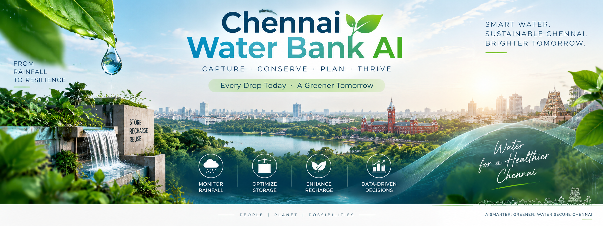
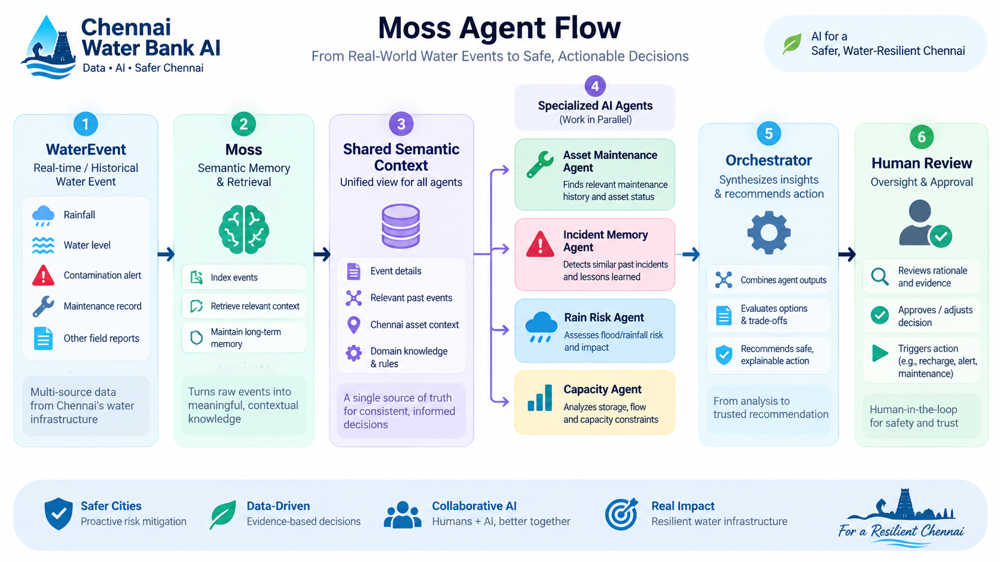
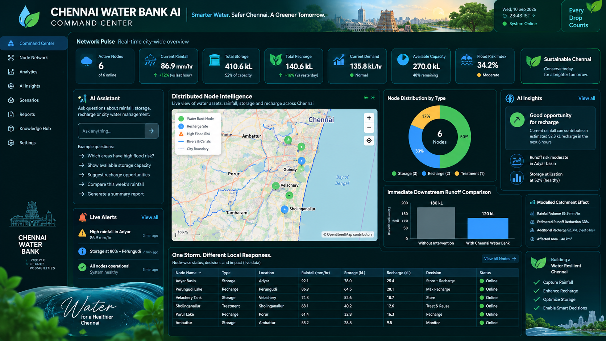

<!-- =========================================================
     CHENNAI WATER BANK AI
     Moss-Powered Collaborative Urban Water Intelligence
     ========================================================= -->

<p align="center">
  
</p>

<h1 align="center">🌧️ Chennai Water Bank AI 💧</h1>

<h3 align="center">
Bank the Rain • Reduce the Flood • Secure the Future
</h3>

<p align="center">
<b>Moss-Powered Collaborative Intelligence for Distributed Urban Water Management</b>
</p>

<p align="center">
A simulation-driven urban water intelligence platform that combines distributed Water Bank nodes,
explainable water-allocation logic, Moss semantic memory, four collaborative advisory agents,
and human-governed decision support.
</p>

<p align="center">


</p>

<p align="center">

<a href="https://github.com/Janicebenita/chennai-water-bank-ai/actions/workflows/ci.yml">

</a>


</p>

<p align="center">


</p>

<p align="center">

<a href="https://chennai-water-bank-ai-staging-1032997828322.asia-south1.run.app/">

</a>

<a href="https://www.youtube.com/watch?v=hvbKTbRtTag">

</a>

<a href="#-moss-semantic-memory">

</a>

</p>

------------------------------------------------------------------------

# 💡 What is Chennai Water Bank AI?

**Chennai Water Bank AI** is a browser-based digital prototype exploring
how distributed urban rainwater assets can be coordinated through
**water intelligence, semantic memory, collaborative advisory agents,
explainable engineering rules and human-governed decision support**.

The system models fictional **Water Bank Nodes** distributed across
Chennai.

Each node evaluates simulated:

🌧️ Rainfall  
💧 Runoff  
🛢️ Storage capacity  
🌱 Recharge capacity  
🧪 Water quality  
🌊 Drain stress  
⚙️ Asset availability

and determines how incoming runoff should be handled.

### 💧 STORE → 🌱 RECHARGE → ↪️ DIVERT → 🌊 CONTROLLED DISCHARGE

The intelligence layer extends the deterministic Water Bank system with:

### 📡 Live Facts → 📝 WaterEvent → 🧠 Moss → 🤖 4 Agents → 🎯 Orchestrator → 👤 Human Decision

> ⚠️ **Demonstration Notice**
>
> Every node, rainfall value, water-quality reading, incident,
> WaterEvent and impact result currently shown by the software prototype
> is **simulated data**.
>
> The application does not claim to represent Chennai government
> measurements, installed municipal infrastructure, verified historical
> incidents, or a validated municipal digital twin.

------------------------------------------------------------------------

# 🚀 Live Demo & Video

| Resource                      | Link                                                                                                          |
|-------------------------------|---------------------------------------------------------------------------------------------------------------|
| 🚀 Public staging application | [Open live demo](https://chennai-water-bank-ai-staging-1032997828322.asia-south1.run.app/)                    |
| 🖥️ AI Command Center          | [Open Command Center](https://chennai-water-bank-ai-staging-1032997828322.asia-south1.run.app/command_center) |
| 🎬 Demonstration video        | [Watch on YouTube](https://www.youtube.com/watch?v=hvbKTbRtTag)                                               |
| 💻 Source code                | [GitHub repository](https://github.com/Janicebenita/chennai-water-bank-ai)                                    |

> The live deployment and the repository may be updated independently.
> Runtime values shown by the application should be treated as scenario
> measurements, not universal benchmarks.

------------------------------------------------------------------------

# 🎯 The Urban Water Challenge

Chennai can experience intense rainfall and local stormwater stress
while also facing dry-period water-security and groundwater pressure.

A conventional urban rainwater asset is often treated as an isolated
physical system.

**Chennai Water Bank asks a different question:**

> ### What if distributed rainwater assets could behave like a coordinated urban water network?

Instead of allowing every suitable litre of rainfall to immediately
become downstream runoff, the system explores whether water can first be
evaluated for:

🏠 Local storage  
🌱 Safe recharge opportunity  
↪️ Safety diversion  
🌊 Controlled discharge

The goal is **not** to claim that distributed Water Bank nodes can
eliminate flooding.

The goal is to demonstrate how distributed intelligence can model the
local retention of suitable stormwater while maintaining transparent
safety constraints.

------------------------------------------------------------------------

# 💧 The Water Bank Concept

Six fictional demonstration nodes represent urban catchments in:

| 📍 Demonstration Zone | Water Bank Role                             |
|-----------------------|---------------------------------------------|
| 🏙️ Velachery          | Distributed urban catchment                 |
| 🏙️ T. Nagar           | Dense urban storage scenario                |
| 🌊 Adyar              | Water-management scenario                   |
| 🏘️ Anna Nagar         | Distributed storage/recharge scenario       |
| 🏭 Perungudi          | Includes contamination safety demonstration |
| 🌆 Tambaram           | Peripheral urban catchment scenario         |

A normalized digital sensor simulator supplies rainfall, storage, soil,
drain-stress and illustrative water-quality inputs.

The deterministic engine then applies:

### 🛡️ Safety Gates → 📊 Capacity Constraints → 🎯 Priority Scores → 💧 Mass-Balanced Allocation

Every simulated litre is accounted for.

------------------------------------------------------------------------

# ✨ Why This Project Is Different

<table>
<tr>
<td width="50%">

### 💧 Water Intelligence

Distributed Water Bank nodes evaluate runoff close to where rainfall
occurs.

</td>
<td width="50%">

### 🧠 Semantic Memory

Operational WaterEvents can be indexed and retrieved through Moss.

</td>
</tr>

<tr>
<td width="50%">

### 🤖 Collaborative Agents

Four specialized advisory agents examine risk, incidents, capacity and
asset condition.

</td>
<td width="50%">

### 📊 Explainable Decisions

Reason codes, rejected alternatives, constraints, scores and mass
balance remain visible.

</td>
</tr>

<tr>
<td width="50%">

### 🛡️ Safety-First Architecture

Water-quality and physical-availability gates remain ahead of advisory
intelligence.

</td>
<td width="50%">

### 👤 Human Governance

Recommendations do not autonomously control physical infrastructure.

</td>
</tr>
</table>

------------------------------------------------------------------------

# 🧠 What Uses Moss / AI and What Is Deterministic?

> **Structured operational data provides current truth. Moss semantic
> memory provides context.**

| Component                                 | Current Implementation                                                        |
|-------------------------------------------|-------------------------------------------------------------------------------|
| Rainfall/runoff calculations              | Deterministic simulated rainfall, catchment area and runoff coefficient       |
| Storage headroom and capacity constraints | Deterministic numeric limits from current structured state                    |
| Water-quality safety gates                | Deterministic thresholds and eligibility rules                                |
| Recharge eligibility                      | Deterministic safety and capacity checks                                      |
| Mass balance and routing                  | Deterministic engineering allocation                                          |
| WaterEvent generation                     | Structured transformation and deterministic event classification              |
| WaterEvent indexing                       | Moss indexes/upserts the semantic representation                              |
| Semantic retrieval                        | **Moss** retrieves relevant contextual evidence                               |
| Shared agent context                      | One bounded Moss retrieval is reused by all four agents                       |
| Rain & Risk Agent                         | Rule-based analysis using authoritative facts plus bounded retrieved context  |
| Incident Memory Agent                     | Presents relevant Moss-retrieved event evidence without inventing incidents   |
| Capacity Agent                            | Deterministic advice from current storage/recharge values                     |
| Asset & Maintenance Agent                 | Availability checks plus relevant maintenance context from retrieved evidence |
| Orchestrator                              | Async coordination, failure isolation and explainable advisory assembly       |
| Human review                              | Final approval, rejection or request for more evidence                        |
| Physical actuation                        | Not autonomously controlled by the AI layer                                   |

**Without Moss, the deterministic Water Bank remains operational but
memoryless. With Moss, the collaborative agents become evidence-aware.**

“Safe” in this repository means that the prototype preserves its
deterministic safety gates and human-review boundary. It is **not** a
certification for physical deployment.

------------------------------------------------------------------------

# 🧠 Moss Semantic Memory

<p align="center">


</p>

Traditional operational dashboards primarily answer:

> **“What is happening now?”**

Chennai Water Bank AI also explores:

> **“Have we seen a similar WaterEvent before?”**  
> **“What happened?”**  
> **“What action was taken?”**  
> **“What contextual evidence should the agents consider?”**

Moss provides the project's **shared semantic-memory and retrieval
layer**.

<p align="center">
  
</p>

### 🔄 Semantic Memory Flow

``` text
Meaningful Operational State
            │
            ▼
       📝 WaterEvent
            │
            ▼
      🧠 Moss Index
chennai-water-bank-events
            │
            ▼
   Semantic Retrieval
            │
            ▼
 Shared Context / Evidence
            │
    ┌───────┼────────┬────────┐
    ▼       ▼        ▼        ▼
 Rain &   Incident Capacity  Asset &
 Risk     Memory             Maintenance
 Agent    Agent    Agent     Agent
    └───────┴────────┴────────┘
            │
            ▼
      🎯 Orchestrator
            │
            ▼
     👤 Human Review
```

------------------------------------------------------------------------

# 📝 WaterEvents

A **WaterEvent** is the semantic unit used to describe a meaningful
operational situation.

| Field                | Purpose                                    |
|----------------------|--------------------------------------------|
| 🆔 Event ID          | Stable event identifier                    |
| 🕐 Timestamp         | When the event occurred                    |
| 📍 Zone              | Demonstration zone                         |
| 🏗️ Asset             | Water Bank node                            |
| ⚠️ Event Type        | Operational event category                 |
| 📋 Summary           | Human-readable event description           |
| 🌧️ Risk Context      | Relevant environmental/operational context |
| 🎯 Action            | Deterministic Water Bank action            |
| 📊 Outcome           | Result of the event                        |
| 🧠 Semantic Text     | Retrieval-oriented representation          |
| 🔗 Source References | Links to originating evidence              |
| 🏷️ Metadata          | Searchable event attributes                |

Meaningful simulator-generated events may include:

💧 Storage routing  
🌱 Recharge opportunities  
🌊 High drain stress  
⚠️ Capacity constraints  
🧪 Water-quality interventions  
🛠️ Asset-unavailable conditions

All simulator-generated events remain explicitly identified as
**SIMULATED DATA**. They are not presented as historical Chennai
incidents.

------------------------------------------------------------------------

# 🤖 Four Collaborative Advisory Agents

<p align="center">


<br/>


</p>

The four advisory agents share the **same bounded Moss retrieval
result** for an analysis request.

They do not independently overwrite live operational facts.

| Agent                            | Responsibility                                              | Primary Evidence                            |
|----------------------------------|-------------------------------------------------------------|---------------------------------------------|
| 🌧️ **Rain & Risk Agent**         | Evaluates rainfall, drain stress and safety context         | Authoritative facts + relevant Moss context |
| 🧠 **Incident Memory Agent**     | Reports retrieved operational precedents                    | Moss evidence                               |
| 💧 **Capacity Agent**            | Evaluates tank headroom and recharge opportunity            | Authoritative numerical facts               |
| 🛠️ **Asset & Maintenance Agent** | Reviews asset availability and relevant maintenance context | Asset state + relevant Moss evidence        |

### 🔒 Shared Context Principle

``` text
ONE semantic retrieval
        ↓
ONE shared immutable context
        ↓
FOUR concurrent advisory agents
```

This prevents each agent from creating an inconsistent version of
operational memory.

------------------------------------------------------------------------

# 🎯 Water Bank Orchestrator

The **Water Bank Orchestrator** is where the system's three intelligence
streams converge.

### 1️⃣ Authoritative Facts

Current structured operational state.

### 2️⃣ Moss Semantic Context

Retrieved WaterEvents relevant to the current situation.

### 3️⃣ Agent Findings

Advisory findings from the four specialized agents.

``` text
              📊 AUTHORITATIVE FACTS
                       │
                       │
🧠 MOSS CONTEXT ───────┼────── 🤖 AGENT FINDINGS
                       │
                       ▼
              🎯 WATER BANK
                ORCHESTRATOR
                       │
                       ▼
              💡 RECOMMENDATION
                       │
                       ▼
                 👤 HUMAN
                  DECISION
```

Semantic results cannot overwrite authoritative numerical facts.

Individual agent failures are isolated so the deterministic Water Bank
analysis can continue.

------------------------------------------------------------------------

# 🏗️ System Architecture

<p align="center">
  
</p>

The architecture separates **authoritative operational truth** from
**semantic contextual memory**.

## 📊 Path A — Authoritative Operational Data

``` text
Rainfall
Storage
Recharge Capacity
Water Quality
Asset Status
GIS
Water Ledger
      │
      ▼
Structured Water Bank Models
      │
      ▼
Water Bank Orchestrator
```

These values remain the source of truth for current operational
calculations.

## 🧠 Path B — Semantic Context

``` text
Operational Situation
       │
       ▼
   WaterEvent
       │
       ▼
      Moss
       │
       ▼
Semantic Evidence
       │
       ▼
Four Collaborative Agents
       │
       ▼
Water Bank Orchestrator
```

### 🛡️ Architectural Rule

> **Semantic memory provides context. Structured operational data
> provides current truth.**

------------------------------------------------------------------------

# 🖥️ AI Command Center

<p align="center">
  
</p>

The Command Center brings together:

📍 GIS / Water Bank node information  
🌧️ Rainfall and risk state  
💧 Storage and recharge capacity  
🧪 Water-quality state  
🧠 Moss context  
🔎 Retrieved evidence  
🤖 Four agent findings  
💡 Orchestrator recommendation  
⏱️ Retrieval and orchestration latency  
⚠️ Limitations and uncertainty  
👤 Human-review controls

### Human Review Controls

``` text
ACCEPT
REJECT
REQUEST MORE EVIDENCE
```

These controls update the decision-support workflow only. They do
**not** directly control valves, pumps, recharge infrastructure or other
physical equipment.

------------------------------------------------------------------------

# 🔄 Collaborative Analysis Request

For each analysis request:

``` text
Current Structured Facts
          │
          ├───────────────┐
          │               │
          ▼               ▼
     WaterEvent        Deterministic
          │             Decision
          ▼               │
        Moss              │
          │               │
          ▼               │
 Shared Semantic Context  │
          │               │
          ▼               │
   Four Advisory Agents   │
          └───────┬───────┘
                  ▼
             Orchestrator
                  │
                  ▼
            Human Review
```

The semantic query can include:

📍 Zone  
🏗️ Asset  
🌧️ Rainfall  
💧 Storage percentage  
📦 Available storage  
🌱 Recharge capacity  
🛠️ Asset availability  
🧪 Water quality  
⚠️ Event type  
🎯 Current deterministic decision

The same retrieved context is reused by all four agents.

------------------------------------------------------------------------

# ⏱️ Runtime Latency

The Command Center exposes runtime timing for the collaborative analysis
pipeline.

Moss retrieval latency is taken from the SDK-provided timing when
available. A local high-resolution monotonic timer is retained only as a
compatibility fallback when a valid SDK timing value is unavailable.

The application can expose:

| Metric                      | Meaning                                                 |
|-----------------------------|---------------------------------------------------------|
| Moss retrieval latency      | Retrieval timing reported by the Moss integration       |
| Agent response time         | Runtime duration for individual advisory agents         |
| Orchestration time          | Concurrent agent stage plus recommendation assembly     |
| Total advisory-request time | Event persistence/indexing, retrieval and orchestration |

Agent durations may overlap because agents run concurrently; they should
not be added together as a sequential latency budget.

> No fixed “sub-10 ms” result is claimed by this repository. The UI
> reports measured runtime values. Actual retrieval latency depends on
> the configured index, runtime instance and environment.

------------------------------------------------------------------------

# 💧 Explainable Water Allocation

The transparent runoff model is:

``` text
runoff_litres =
rainfall_mm × catchment_area_m² × runoff_coefficient
```

because:

``` text
1 mm rainfall over 1 m² = 1 litre
```

Tank headroom is:

``` text
available_storage_litres =
storage_capacity_litres - current_storage_litres
```

Estimated interval recharge capacity uses configured recharge capacity,
interval duration and a simple unsaturated-soil factor.

These equations are transparent engineering approximations for the
prototype. They do **not** constitute a calibrated hydraulic drainage or
groundwater model.

------------------------------------------------------------------------

# 📊 Measurable Scenario Impact

Impact Analytics reuses the allocation ledger rather than inventing a
separate impact model.

It displays:

🌧️ Incoming simulated runoff  
💧 Water routed to storage  
🌱 Modelled recharge allocation  
↪️ Safety diversion  
🌊 Controlled discharge  
🏦 Total locally retained water  
📉 Immediate downstream runoff  
⏱️ Decision and advisory timing

### Local Runoff Retention Formula

Instead of using a placeholder such as **X%**, the project defines the
metric explicitly:

``` text
locally_retained_litres =
stored_litres + recharged_litres
```

``` text
local_runoff_retention_percent =
100 × locally_retained_litres / incoming_runoff_litres
```

For a scenario with no incoming runoff:

``` text
local_runoff_retention_percent = 0
```

Immediate downstream runoff is represented by the water that remains
after the locally retained allocation, subject to the model's
diversion/discharge accounting.

### Correct Interpretation

> **Local runoff retention percentage = the percentage of simulated
> incoming runoff allocated to local storage plus modelled recharge in
> that scenario.**

This metric is **not a flood-reduction percentage**.

The project does **not** claim that a calculated retention percentage
means the same percentage reduction in flood depth, inundation area,
flood probability, property damage or citywide flood risk.

A validated flood-reduction claim would require a calibrated
hydraulic/hydrologic model incorporating factors such as
drainage-network capacity, topography, time of concentration, spatial
rainfall, tides, backwater effects and catchment interactions. That
model is outside the current prototype.

------------------------------------------------------------------------

# 🎛️ Deterministic Decision Logic

The deterministic decision engine prioritizes:

### 🛡️ Safety → 🌊 Immediate Runoff → 💧 Storage → 🌱 Recharge → ↪️ Controlled Release

Possible actions include:

| Action                    | Meaning                                                |
|---------------------------|--------------------------------------------------------|
| 💧 `STORE`                | Route suitable water to available storage              |
| 🌱 `RECHARGE`             | Route eligible water toward recharge                   |
| 💧🌱 `STORE_AND_RECHARGE` | Allocate between storage and recharge                  |
| ↪️ `DIVERT`               | Divert water because of safety/eligibility constraints |
| 🌊 `CONTROLLED_DISCHARGE` | Release runoff when storage/recharge cannot accept it  |

Every result can expose:

✅ Reason codes  
✅ Human-readable explanation  
✅ Rejected alternatives  
✅ Physical constraints  
✅ Priority scores  
✅ Mass-balanced allocation

------------------------------------------------------------------------

# 🧪 Water-Quality Safeguards

Illustrative safety logic considers:

🧫 Contamination  
⚗️ pH  
🌫️ Turbidity  
🌧️ First-flush condition  
🌱 Soil saturation  
🛠️ Recharge availability

Safety examples include:

- detected contamination or out-of-range pH forces diversion;
- first flush blocks direct recharge in the demonstration;
- moderate turbidity can allow storage while blocking recharge;
- only water passing the stricter illustrative screen may be considered
  for recharge;
- high soil saturation can block recharge;
- unavailable recharge infrastructure blocks recharge.

> ⚠️ **Water Quality Notice**
>
> Prototype water-quality logic is illustrative. Real groundwater
> recharge requires certified site-specific testing, treatment design,
> hydrogeological assessment and regulatory approval.

------------------------------------------------------------------------

# 🧪 Simulation Methodology

The built-in storm contains **eight 15-minute rainfall-intensity
pulses**.

Each fictional node has a synthetic bias so the same network event
produces different:

🌧️ Local rainfall  
💧 Storage pressure  
🌱 Soil saturation  
🌊 Drain stress  
🧪 Water-quality conditions

Perungudi intentionally includes an early contaminated-reading
demonstration so the safety override can be shown during a live demo.

The simulator is deterministic to support repeatable demonstrations.

> All software-demo values are synthetic assumptions rather than
> municipal measurements.

------------------------------------------------------------------------

# 🔌 Physical Prototype

The broader Chennai Water Bank work also includes an **ESP32-based
physical prototype** used to explore how sensing and local deterministic
routing could connect to the software architecture.

The prototype work has included:

| Function              | Prototype Element                       |
|-----------------------|-----------------------------------------|
| 📏 Tank level         | Ultrasonic sensing                      |
| 🧪 Water quality      | Turbidity sensing                       |
| 🌱 Recharge condition | Soil-moisture sensing                   |
| 🌧️ Rain condition     | Rain sensing                            |
| 💧 Flow verification  | Flow sensor                             |
| ⚙️ Local routing      | ESP32 deterministic controller          |
| 🔌 Output switching   | Relay-controlled storage/recharge paths |
| 📡 Connectivity       | Wi-Fi telemetry/setup workflow          |

The local controller is designed around a fail-safe principle: physical
routing logic remains deterministic and does not depend on a cloud AI
response.

### Prototype Routing Concept

``` text
Sensor Readings
      │
      ▼
Water Quality Check
      │
      ├── Unsafe ─────────────► DIVERT
      │
      ▼
Storage Capacity Check
      │
      ├── Capacity Available ─► STORE
      │
      ▼
Recharge Eligibility Check
      │
      ├── Eligible ───────────► RECHARGE
      │
      ▼
Controlled Diversion / Discharge
```

> The hackathon software demonstration remains simulation-driven. The
> physical prototype should not be interpreted as deployed Chennai
> infrastructure or as autonomous AI control of municipal water assets.

------------------------------------------------------------------------

# 🏗️ Physical Process Boundary

A future field architecture can follow:

``` text
🌧️ Rain
  ↓
📡 Sensors
  ↓
⚙️ ESP32 / Edge Controller / PLC
  ↓
💻 Water Bank Software
  ↓
🛡️ Safety + Capacity Decision
  ↓
⚙️ Controller Command
  ↓
🔌 Driver / Relay
  ↓
🚰 Motorized Valve
  ↓
💧 Storage / Recharge / Diversion
  ↓
📡 Flow + Position Verification
```

The AI advisory layer is not granted final physical decision authority.

------------------------------------------------------------------------

# 🧰 Engineering Features

<table>
<tr>
<td width="50%">

### 🖥️ Command Center

City-scale operational view with simulated KPI cards and Chennai map.

</td>
<td width="50%">

### 🌧️ Storm Simulation

One-click deterministic network storm scenario.

</td>
</tr>
<tr>
<td width="50%">

### 🧠 Collaborative Intelligence

Moss semantic retrieval plus four specialized advisory agents.

</td>
<td width="50%">

### 🔍 Explainability

Reason codes, evidence, constraints and rejected alternatives.

</td>
</tr>
<tr>
<td width="50%">

### 🧪 Scenario Lab

Predefined scenarios and parameter-driven stress testing.

</td>
<td width="50%">

### 📊 Impact Analytics

Dynamic runoff, storage, recharge and local-retention metrics.

</td>
</tr>
</table>

------------------------------------------------------------------------

# 🧪 Testing, CI & Coverage

The repository includes a GitHub Actions workflow at:

``` text
.github/workflows/ci.yml
```

The workflow validates the project on **Python 3.12 / Ubuntu 24.04** and
is designed to run on pushes and pull requests to `main`, with manual
workflow dispatch available.

Run locally:

``` bash
pytest
python -m ruff check .
python -m pip check
python -m compileall app.py pages src tests
```

The default pytest configuration calculates coverage, writes
`coverage.xml`, and enforces a **75% minimum coverage gate** across
`src`, `pages` and `app.py`.

Current validated local engineering state:

``` text
Tests:          80 passed, 0 failed
Coverage:       95.13%
Coverage gate:  75%
Python:         3.12
Linting:        PASS
Compilation:    PASS
```

<p align="center">


</p>

Coverage includes WaterEvent generation, Moss
conversion/indexing/retrieval boundaries, latency propagation/fallback,
agent isolation, authoritative-fact immutability, persistence resilience
and Streamlit workflows.

------------------------------------------------------------------------

# 📦 Reproducible Dependencies

Direct dependencies are maintained in:

``` text
requirements.in
```

The resolved dependency set is pinned in:

``` text
requirements.txt
```

The lock is intended for the project's Python 3.12 environment.

To intentionally refresh dependencies under review:

``` bash
uv pip compile requirements.in \
  --python-version 3.12 \
  --universal \
  --no-emit-index-url \
  -o requirements.txt
```

Dependency changes should be reviewed rather than silently upgraded
during a hackathon deployment.

------------------------------------------------------------------------

# 💾 Persistence & Firestore Resilience

The baseline application can operate entirely in memory.

Optional Firestore persistence is available.

| Variable                     |     Default | Purpose                               |
|------------------------------|------------:|---------------------------------------|
| `DATA_BACKEND`               |    `memory` | `memory` or `firestore`               |
| `DEMO_MODE`                  |      `true` | Enables seeded demonstration behavior |
| `GOOGLE_CLOUD_PROJECT`       |       unset | Optional GCP project                  |
| `FIRESTORE_DATABASE`         | `(default)` | Firestore database                    |
| `FIRESTORE_MAX_ATTEMPTS`     |         `3` | Bounded Firestore attempts            |
| `FIRESTORE_INITIAL_DELAY_MS` |       `200` | Initial retry delay                   |
| `FIRESTORE_MAX_DELAY_MS`     |      `2000` | Maximum backoff delay                 |
| `FIRESTORE_TIMEOUT_SECONDS`  |         `5` | Per-RPC timeout                       |

Collections include:

``` text
nodes
simulation_runs
node_events
decisions
impact_snapshots
```

Firestore resilience includes:

- bounded retries for transient failures;
- exponential backoff with jitter;
- per-RPC timeout;
- no retry for authentication/permission failures;
- explicit in-memory fallback after exhaustion;
- reuse of event IDs across retries to reduce duplicate-write risk;
- structured non-secret logging;
- preservation of seeded/last-successful node state where available.

After fallback, the UI can explicitly report:

``` text
Persistence: MEMORY FALLBACK
```

Memory fallback is not durable and is not automatically replayed to
Firestore.

------------------------------------------------------------------------

# 🔥 Failure & Degraded Modes

| Condition                      | Behavior                                                   |
|--------------------------------|------------------------------------------------------------|
| 🧠 Moss disabled               | Deterministic Water Bank continues without semantic memory |
| 🔑 Moss credentials missing    | Semantic context unavailable; application continues        |
| ❌ Moss indexing failure       | No historical evidence is fabricated                       |
| 🔍 Moss retrieval failure      | Structured operational analysis continues                  |
| 🤖 One agent fails             | Other agents and authoritative facts remain available      |
| 🧰 Maintenance evidence absent | System explicitly reports missing evidence                 |
| 💾 Firestore transient failure | Bounded retry/backoff before fallback                      |
| 💾 Firestore unavailable       | Explicit in-memory fallback                                |
| 📡 Physical data absent        | Simulation limitation remains visible                      |
| 👤 Human approval absent       | Approval remains pending                                   |

------------------------------------------------------------------------

# ⚙️ Technology Stack

<p align="center">


</p>

| Layer              | Technology / Approach               |
|--------------------|-------------------------------------|
| 🐍 Application     | Python 3.12                         |
| 🖥️ Interface       | Streamlit                           |
| 🧠 Semantic Memory | Moss                                |
| 🤖 Agent Layer     | Typed collaborative advisory agents |
| 🎯 Orchestration   | Async Python orchestration          |
| 📊 Data Models     | Structured Water Bank domain models |
| 🗺️ Spatial View    | Chennai GIS-style visualization     |
| 💾 Persistence     | Memory / optional Firestore         |
| ☁️ Cloud           | Google Cloud Run                    |
| 📦 Container       | Docker                              |
| 🧪 Testing         | pytest + pytest-cov                 |
| 🔎 Linting         | Ruff                                |
| 🔄 CI              | GitHub Actions                      |

------------------------------------------------------------------------

# 🚀 Run Locally

## Prerequisites

``` text
Python 3.12+
```

Create a virtual environment:

``` bash
python -m venv .venv
```

### Windows PowerShell

``` powershell
.venv\Scripts\Activate.ps1
```

### macOS / Linux

``` bash
source .venv/bin/activate
```

Install pinned dependencies:

``` bash
python -m pip install -r requirements.txt
```

Launch:

``` bash
streamlit run app.py
```

Cloud Run-equivalent local port:

``` bash
streamlit run app.py \
  --server.address=0.0.0.0 \
  --server.port=8080
```

------------------------------------------------------------------------

# 🧠 Moss Configuration

Moss is optional in baseline mode.

Without Moss credentials, the deterministic Water Bank continues
operating without semantic historical context.

| Variable           |                     Default | Purpose                             |
|--------------------|----------------------------:|-------------------------------------|
| `MOSS_ENABLED`     |                     `false` | Enables Moss indexing and retrieval |
| `MOSS_PROJECT_ID`  |                       unset | Moss project identifier             |
| `MOSS_PROJECT_KEY` |                       unset | Moss project credential             |
| `MOSS_INDEX_NAME`  | `chennai-water-bank-events` | WaterEvent semantic index           |
| `MOSS_TOP_K`       |                         `4` | Bounded semantic result count       |

### Setup

1.  Create/configure a Moss project.
2.  Supply the project ID and key securely.
3.  Set `MOSS_ENABLED=true`.
4.  Start Chennai Water Bank AI.
5.  Run a meaningful simulated Water Bank scenario.
6.  Run Collaborative Analysis.
7.  Confirm Moss status and retrieved evidence.
8.  Inspect the measured runtime retrieval timing.

> 🔐 Never commit `MOSS_PROJECT_KEY`, `.env`, service-account JSON files
> or other credentials to Git.

------------------------------------------------------------------------

# ☁️ Google Cloud Deployment

The application is containerized for Google Cloud Run.

Current public staging entry point:

``` text
https://chennai-water-bank-ai-staging-1032997828322.asia-south1.run.app/
```

Example deployment pattern:

``` bash
gcloud auth login
gcloud config set project YOUR_PROJECT_ID

gcloud run deploy chennai-water-bank-ai-staging \
  --source . \
  --region asia-south1 \
  --allow-unauthenticated \
  --port 8080
```

Moss and other credentials should be supplied through secure secret
management rather than bundled into the repository or image.

------------------------------------------------------------------------

# 🎬 Hackathon Demo Flow

A concise judge demonstration can follow:

### 1️⃣ Open Command Center

Show the distributed Water Bank network.

### 2️⃣ Run Simulated Chennai Storm

Trigger the deterministic simulation.

### 3️⃣ Select a Node

Show rainfall, storage, water quality, recharge and drain conditions.

### 4️⃣ Show Deterministic Decision

Explain that current numeric facts and safety gates remain
authoritative.

### 5️⃣ Run Collaborative Analysis

Trigger the four-agent workflow.

### 6️⃣ Show Moss Evidence

Point to retrieved WaterEvents and timestamps.

### 7️⃣ Show Shared Context

Explain that one Moss retrieval is reused by all four agents.

### 8️⃣ Show Runtime Timing

Show Moss retrieval, agent and orchestration timing separately.

### 9️⃣ Show Impact Analytics

Explain stored litres, modelled recharge and the **Local Runoff
Retention** formula.

### 🔟 Show Human Review

Point to Accept, Reject and Request More Evidence.

> **“The deterministic Water Bank provides current operational truth.
> Moss gives the agents shared contextual memory. The AI advises, and
> the human remains the final decision authority.”**

------------------------------------------------------------------------

# 🗣️ Project Demonstration Statement

> ### “We are not claiming to eliminate Chennai floods.
>
> We are demonstrating how distributed water intelligence can model how
> much suitable simulated runoff is allocated to local storage and
> recharge before downstream release.
>
> Every litre is calculated, safety interventions remain visible, Moss
> evidence is traceable, and every advisory recommendation remains
> subject to human review.”

------------------------------------------------------------------------

# 🛡️ Responsible Engineering

Chennai Water Bank AI follows a governance-first boundary:

> ### AI may retrieve, analyse, explain and recommend — but consequential physical action remains human-controlled.

No collaborative agent autonomously issues commands to:

🚰 Valves  
⚙️ Pumps  
🌱 Recharge infrastructure  
🌊 Drainage gates  
🏗️ Physical Water Bank assets

The deterministic safety layer and human operator remain outside the
semantic-memory authority boundary.

------------------------------------------------------------------------

# ⚠️ Limitations

The current project is a **prototype and demonstration environment**.

- Software-demo Water Bank nodes and operational values are simulated.
- Demonstration locations do not represent installed municipal
  infrastructure.
- The runoff model is not a calibrated city hydraulic model.
- The model omits detailed pipe-network hydraulics, topography, tides,
  backwater effects and coupled catchment behavior.
- Modelled recharge does not prove local infiltration or aquifer
  suitability.
- Prototype water-quality thresholds do not replace certified testing.
- Local runoff retention is not equivalent to flood depth or flood-risk
  reduction.
- Moss semantic evidence provides context and cannot overwrite current
  authoritative numerical facts.
- Advisory agents are not granted autonomous physical control.
- Runtime latency depends on the active environment and should be
  measured rather than assumed.

------------------------------------------------------------------------

# 🔭 Future Roadmap

With validated field data and appropriate engineering review, future
work can investigate:

### 📡 Field IoT Integration

Normalize verified sensor telemetry through the existing sensor-data
boundary.

### 🌧️ Rainfall Forecasting

Integrate validated short-term localized rainfall forecasts.

### 🌊 Hydraulic Validation

Connect the Water Bank allocation model to a calibrated
hydrologic/hydraulic model.

### 🧠 Richer Agent Reasoning

Evaluate additional model-based advisory reasoning while preserving
authoritative facts and deterministic safety gates.

### 🔎 Observability

Add end-to-end tracing, correlation IDs and richer latency diagnostics.

### 🔐 Security Hardening

Extend authentication, authorization, rate limiting, secret rotation and
audit controls for production environments.

### 🏙️ Real Asset Registry

Replace fictional nodes with validated infrastructure only under
authorized deployment conditions.

------------------------------------------------------------------------

# 👥 Team

## LOGOS VICTORIS

**Chennai Water Bank AI**  
Moss-Powered Collaborative Intelligence for Distributed Urban Water
Management

------------------------------------------------------------------------

# 🤝 Explore the Project

<p align="center">

<a href="https://github.com/Janicebenita/chennai-water-bank-ai">

</a>

<a href="https://chennai-water-bank-ai-staging-1032997828322.asia-south1.run.app/">

</a>

<a href="https://www.youtube.com/watch?v=hvbKTbRtTag">

</a>

</p>

<p align="center">
<b>Distributed Water Intelligence • Semantic Memory • Collaborative Agents • Human-Governed Decisions</b>
</p>

<h3 align="center">
🌧️ Bank the Rain • 💧 Reduce the Flood • 🌱 Secure the Future
</h3>
